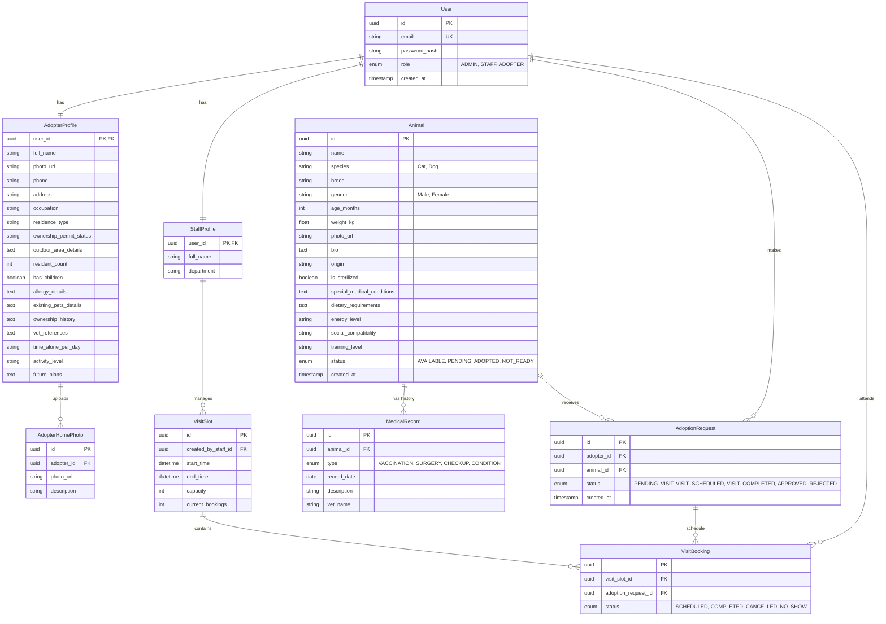

# Core Entity Relationship Diagram (ERD): Malik Shelter

## Entity Dictionary

### 1. User & Profiles
*   **User**: Central authentication entity.
*   **AdopterProfile**: Expanded to include all PRD requirements:
    *   *Identity*: Occupation, Contact.
    *   *Housing*: Permit status, Outdoor details.
    *   *Home Photos*: Stored in `AdopterHomePhoto`.
    *   *Lifestyle/Experience*: Vet refs, history, future plans.

### 2. Animal Inventory
*   **Animal**: Includes detailed adoption criteria:
    *   *Background*: Origin.
    *   *Medical*: Sterilization, Diet, Conditions.
    *   *Personality*: Explicit fields for Energy, Social, Training.
*   **MedicalRecord**: Log of deep history (vaccines, surgeries).

### 3. Operations
*   **VisitSlot/Booking**: Manages the "Appointment-only" workflow.
