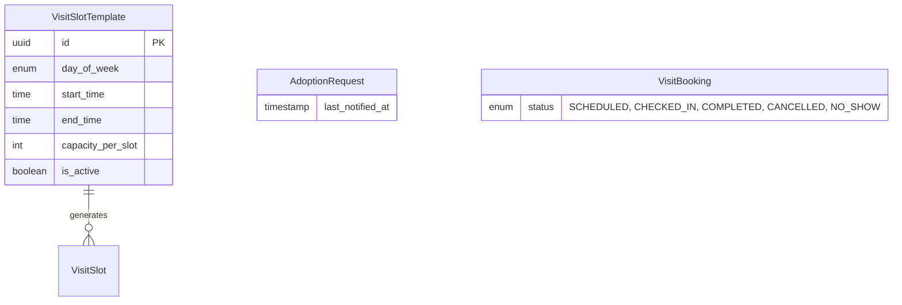

# ERD Extension: Adoption Flow

## Executive Summary
This document defines the database schema changes required to support the Adoption Flow feature, focusing on automated slot generation and refined status tracking for visit requests.

## Entity Catalog (Delta)

| Entity Name | Description | Type | Primary Key |
|-------------|-------------|------|-------------|
| `VisitSlotTemplate` | Definitions for recurring daily visit slots. | Strong | `id` |

---

## Entity Details

### VisitSlotTemplate
**Description:** Stores the blueprint for fixed daily slots used for scheduling visits.
**Type:** Strong Entity

**Attributes:**
| Attribute | Data Type | Constraints | Description |
|-----------|-----------|-------------|-------------|
| `id` | uuid | PK | Unique identifier. |
| `day_of_week` | enum | NOT NULL | Monday, Tuesday, etc. (or ALL). |
| `start_time` | time | NOT NULL | e.g., 10:00:00. |
| `end_time` | time | NOT NULL | e.g., 11:00:00. |
| `capacity_per_slot` | int | NOT NULL | Default number of adopters allowed per slot. |
| `is_active` | boolean | DEFAULT true | Whether this template is currently in use. |

### AdoptionRequest (Update)
**Description:** Adding refined status tracking.
**Attributes (Changes Only):**
| Attribute | Data Type | Constraints | Description |
|-----------|-----------|-------------|-------------|
| `status` | enum | Update | Added `REJECTED_AUTO` (for concurrent applicants) and `NOTIFIED_CLEANUP` (for audit). |
| `last_notified_at` | timestamp | Optional | Tracks when the adopter was last alerted about a status change. |

### VisitBooking (Update)
**Description:** Adding attendance tracking.
**Attributes (Changes Only):**
| Attribute | Data Type | Constraints | Description |
|-----------|-----------|-------------|-------------|
| `status` | enum | Update | Added `CHECKED_IN` to track physical arrival at the shelter. |

---

## Relationship Specifications (Delta)

| Relationship | Entity A | Entity B | Cardinality | Participation | Description |
|--------------|----------|----------|-------------|---------------|-------------|
| generates | `VisitSlotTemplate` | `VisitSlot` | 1:N | Total | Templates are used to instantiate actual slots on a specific date. |

---

## ERD Notation (Delta)

---

## Design Decisions & Notes
1.  **Template System**: Instead of staff manually creating `VisitSlot` every day, they manage `VisitSlotTemplate`. A background job (e.g., cron) will generate `VisitSlot` records for the upcoming 7-14 days based on these templates.
2.  **Concurrency Management**: The `capacity_per_slot` field in the template allows for future scalability if the shelter wants to allow multiple simultaneous visits, though MVP defaults to 1 per pet.
3.  **Audit Trail**: `last_notified_at` is added directly to `AdoptionRequest` to ensure we don't spam adopters with repeated notifications for the same status change.
