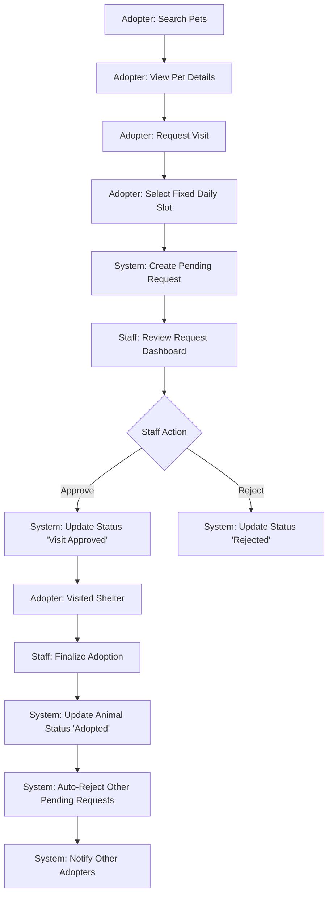

# Product Requirements Document (PRD) Addendum: Adoption Flow

## Overview

| Metadata | Details |
| :--- | :--- |
| **Feature Name** | Adoption Flow |
| **Target Release** | Q4 2026 |
| **Status** | In Review |
| **Document Owner** | Product Manager |

---

## Quick Links
- [Design Mockups (Figma)](#) (Placeholder)
- [Technical Design (TDD)](#) (Placeholder)
- [API Contract](#) (Placeholder)

---

## Background

### Context
Malik Shelter currently manages adoptions manually. This leads to inefficiencies in scheduling and a lack of transparency for adopters regarding the status of their requests.

### Problem Statement
Prospective adopters find it difficult to coordinate visits, and staff spend excessive time managing manual schedules and notifying applicants when a pet is no longer available.

---

## Objectives

### Business Objectives
- Reduce manual scheduling overhead for staff by 50%.
- Decrease the average time from request to visit confirmation to under 24 hours.
- Maintain transparent communication with adopters during the adoption cycle.

### User Objectives
- **Adopters**: Easily book a visit date from predefined daily slots.
- **Staff**: Efficiently review and manage adoption requests from a central dashboard.

---

## Success Metrics

| Metric | Baseline | Target | Measurement Method |
| :--- | :--- | :--- | :--- |
| confirm_visit_latency | 2-3 days | < 24 hours | Time from "Request Sent" to "Status Updated" |
| auto_rejection_rate | Manual | 100% | % of pending requests auto-rejected on adoption |
| adopter_satisfaction | N/A | > 4.5/5 | Post-visit digital survey |

---

## Scope

### MVP 1 Goals ✅
- Implement "Request Visit" interaction from Pet Details.
- Provide fixed daily slots for scheduling (e.g., 10 AM, 2 PM, 4 PM).
- Staff dashboard for reviewing, approving, or rejecting requests.
- Automated rejection of concurrent requests upon final adoption.
- Notification system for status changes and auto-rejections.

### Out-of-Scope ❌
- Dynamic scheduling (e.g., staff setting custom hour-by-hour availability).
- Automated background checks or profile verification (Manual staff check).
- In-app chat for coordination (Email/In-app notifications only).

---

## User Flow

---

## User Stories

| ID | User Story | Acceptance Criteria | Design | Notes | Platform |
| :--- | :--- | :--- | :--- | :--- | :--- |
| **US-AF1** | As an Adopter, I want to request a visit for a specific animal | **Given** I am on a Pet Details page **When** I click "Request Visit" **Then** I see the available fixed daily slots for the next 7 days | [Link] | Slots are fixed | Web |
| **US-AF2** | As an Adopter, I want to receive a notification when my request status changes | **Given** my request was approved or rejected **When** the staff updates the status **Then** I receive a notification in my dashboard/email | [Link] | | Web |
| **US-AF3** | As Staff, I want to see all pending adoption requests in one place | **Given** I am on the Staff Dashboard **When** I navigate to "Adoption Requests" **Then** I see a list of pending requests with Adopter Info and Pet Details | [Link] | | Web |
| **US-AF4** | As Staff, I want to manually approve or reject a request | **Given** I am reviewing a pending request **When** I click "Approve" or "Reject" **Then** the request status is updated and the Adopter is notified | [Link] | | Web |
| **US-AF5** | As the System, I want to auto-reject other requests when an animal is adopted | **Given** an animal status is updated to "Adopted" **When** there are other "Pending" or "Approved" visit requests for that animal **Then** those requests are moved to "Rejected - Pet Adopted" **And** those adopters are notified | N/A | | Backend |

---

## Analytics & Tracking

| Event | Trigger | Data |
| :--- | :--- | :--- |
| `visit_request_initiated` | Click "Request Visit" | `{ pet_id: "123", adopter_id: "456" }` |
| `visit_slot_selected` | Slot Selection | `{ pet_id: "123", slot_time: "2026-02-15T10:00:00" }` |
| `request_status_updated` | Staff Approval/Rejection | `{ request_id: "789", new_status: "approved" }` |
| `auto_rejection_triggered` | Adoption Finalized | `{ animal_id: "123", rejected_count: 5 }` |

---

## Open Questions

| ID | Question | Status |
| :--- | :--- | :--- |
| Q1 | What are the specific fixed daily slots? (e.g., how many and what times?) | Pending |
| Q2 | Should there be a limit on how many pending requests an adopter can have? | Pending |

---

## Notes & Considerations
- **Concurrency**: Ensure that two adopters cannot book the same slot for the same animal if the shelter only allows one visit at a time.
- **Notification**: Consider using the "Premium Notification System" designed previously.

---

## Appendix
- **Fixed Daily Slots**: Predefined time intervals (e.g., Morning 10AM, Afternoon 2PM).
- **Auto-Rejection**: The systematic process of closing open inquiries once the primary goal (adoption) is achieved for a specific animal.
