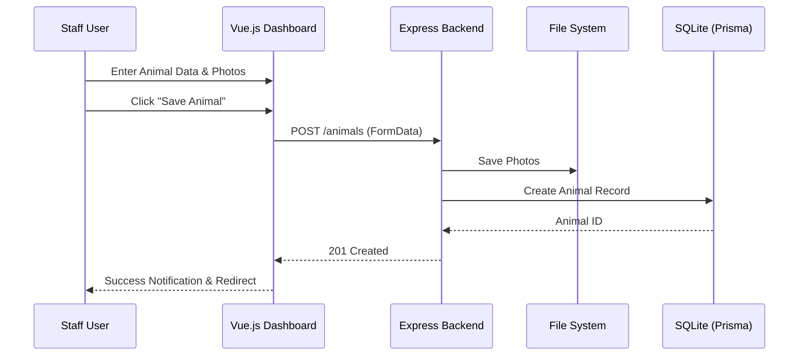

# Technical Design Document: Animal Management

**Mode:** HEAVY
**Project:** Malik Shelter - Animal Management Extension
**Version:** 1.0
**Date:** 2026-02-10
**Author:** Antigravity
**Status:** Draft

---

## 1. Executive Summary
This document specifies the technical implementation for the Animal Management feature. While the backend and database schema already support the required animal fields, the frontend currently lacks the interface for adding and editing these records.

The primary technical focus is on:
1.  Extending the existing **Pet Inventory** dashboard.
2.  Implementing a robust, multi-section **Animal Form** component.
3.  Integration with the existing `POST /animals` and `PUT /animals/:id` endpoints (including multi-photo handling).

## 2. System Architecture

### 2.1 Architecture Overview
The system follows a standard Vue.js + Express + Prisma (SQLite) architecture. The Animal Management extension primarily impacts the Frontend layer.

```mermaid
flowchart TD
    subgraph Frontend (Vue.js)
        Inventory[Inventory Page]
        AnimalForm[AnimalForm Component]
        AuthStore[useAuth Composable]
    end

    subgraph Backend (Express)
        Route[Animal Router]
        Ctrl[Animal Controller]
        PhotoCtrl[Multer Middleware]
        Service[Animal Service]
    end

    subgraph Database (Prisma/SQLite)
        DB[(Animal Table)]
    end

    Inventory --> AnimalForm
    AnimalForm -- Multi-part Form --> Route
    Route --> PhotoCtrl
    PhotoCtrl --> Ctrl
    Ctrl --> Service
    Service --> DB
```

### 2.2 Component Architecture (Delta)
| Component | Responsibility (Delta) | Technology | Dependencies |
|-----------|------------------------|------------|--------------|
| `Inventory.vue` | Add "Add Pet" button and "Edit" action. | Vue 3 | `InventoryTable.vue` |
| `AnimalForm.vue` | [NEW] Multi-section form for all animal data. | Vue 3 | `FileUpload`, `TailwindCSS` |
| `AnimalService` | [EXISTING] Handles data persistence. | TypeScript/Prisma | `schema.prisma` |

---

## 3. Data Architecture (Delta Focus)

### 3.1 Data Model (Existing Coverage)
The `Animal` model in `prisma/schema.prisma` already covers all requirements. No schema changes are required.

### 3.2 Data Flow


---

## 4. API Design (Delta Focus)
Using established endpoints from [api-contract.md](file:///d:/Dyta/BZ/pet-adopt/docs/features/animal-management/api-contract.md).

---

## 5. Component Design (Delta Focus)

### 5.1 Frontend Architecture
| Wireframe Screen | Component(s) | State Requirements | API Calls |
|------------------|--------------|-------------------|-----------|
| Animal Dashboard | `Inventory.vue`, `InventoryTable.vue` | `animals[]`, `loading` | `GET /animals` |
| Add/Edit Animal  | `AnimalForm.vue` (New) | `formData`, `isSubmitting`, `photoPreviews` | `POST /animals`, `PUT /animals/:id` |

### 5.2 AnimalForm Logic
The form will use a reactive `formData` object mapped to the Animal schema.
- **Sectioned Navigation**: Use a simple tab or scroll-spy layout for usability.
- **Photo Handling**: 
  - Manage a list of `File` objects for upload.
  - Generate temporary URLs for local preview before upload.
  - Enforce 5MB limit per file in the `change` event listener.

---

## 6. Technical Risks & Mitigations

| Risk | Impact | Probability | Mitigation |
|------|--------|-------------|------------|
| Large Photo Uploads | Medium | High | Frontend & Backend validation (Max 5MB). |
| Data Consistency | Low | Low | Backend uses Prisma Transactions for Animal + Photo creation. |

---

## 7. Appendices
### Appendix C: Reference Documents
- [PRD Addendum](file:///d:/Dyta/BZ/pet-adopt/docs/features/animal-management/prd-addendum.md)
- [EPIC](file:///d:/Dyta/BZ/pet-adopt/docs/features/animal-management/epic.md)
- [API Contract](file:///d:/Dyta/BZ/pet-adopt/docs/features/animal-management/api-contract.md)
- [Wireframes](file:///d:/Dyta/BZ/pet-adopt/docs/features/animal-management/wireframes.md)
