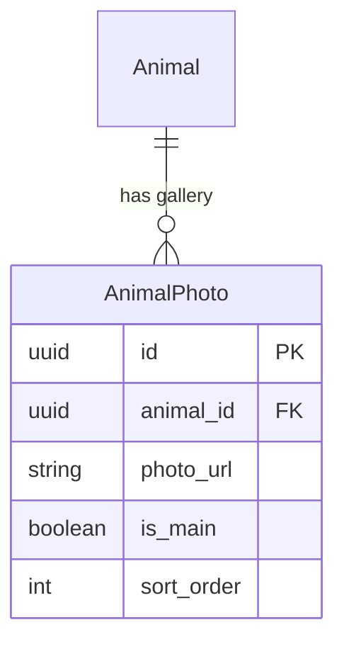

# ERD Extension: Pet Discovery & Management

## 1. New Entities

### AnimalPhoto
Stores the gallery images for an animal profile.
*   **Type**: Weak Entity (dependent on Animal).

| Attribute | Type | Constraints | Description |
| :--- | :--- | :--- | :--- |
| `id` | uuid | PK | Unique identifier. |
| `animal_id` | uuid | FK, Not Null | Reference to parent Animal. |
| `photo_url` | string | Not Null | S3/Cloudinary URL. |
| `is_main` | boolean | Default: false | True if this is the primary cover image. |
| `sort_order` | int | Default: 0 | specific ordering for gallery. |
| `created_at` | timestamp | Not Null | Upload time. |

---

## 2. Modified Entities

### Animal (Enum Updates)
*   **Status**: Add `ARCHIVED` to the enum list.
    *   *Old*: `AVAILABLE, PENDING, ADOPTED, NOT_READY`
    *   *New*: `AVAILABLE, PENDING, ADOPTED, NOT_READY, ARCHIVED`

---

## 3. Relationships

## 4. Notes
*   **Logic**: `Animal.photo_url` (in Core ERD) can be kept as a denormalized field for the "Main" photo to make list queries faster (avoiding joins), OR we can remove it and query `AnimalPhoto where is_main=true`.
    *   *Decision*: **Keep `Animal.photo_url` in Core** as a cached thumbnail for performance. `AnimalPhoto` is for the full gallery view.
