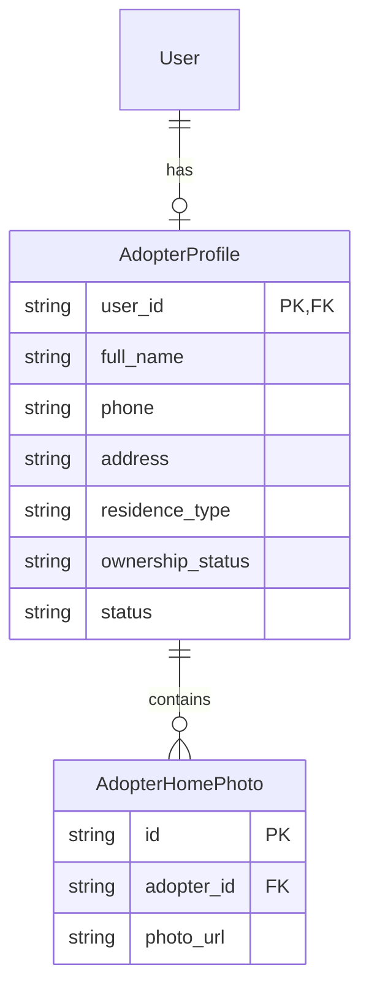

# ERD Extension: Adopter User Profiles

## Overview
This document specifies the database schema extensions required to support comprehensive Adopter Profiles. While the Core ERD outlined these entities, they are not yet implemented in the current Prisma schema.

## New Entities

### 1. AdopterProfile
**Description**: Stores detailed personal, housing, and lifestyle information for potential adopters.
**Type**: Strong Entity (One-to-One relationship with `User`).

| Attribute | Data Type | Constraints | Description |
|-----------|-----------|-------------|-------------|
| `user_id` | String | PK, FK (User.id) | Links to the central User account |
| `full_name` | String | NOT NULL | Adopter's legal name |
| `photo_url` | String | | Identity photo (optional/required for finalization) |
| `phone` | String | | Contact phone number |
| `address` | String | | Physical residence address |
| `occupation` | String | | Current employment/occupation |
| `residence_type` | String | | e.g., "House", "Apartment", "Studio" |
| `ownership_status` | String | | e.g., "Own", "Rent" |
| `landlord_permit_url`| String | | Link to permit document if renting |
| `outdoor_area` | String | | e.g., "Fenced Yard", "Unfenced", "None" |
| `resident_count` | Int | | Number of people in the household |
| `has_children` | Boolean | | Presence of children in the home |
| `allergy_details` | String | | Details on pet-related allergies |
| `existing_pets` | String | | Summary of current pets in household |
| `ownership_history` | String | | Narrative of previous pet ownership |
| `vet_references` | String | | Contact info for previous/current veterinarians |
| `time_pet_alone` | String | | Estimated hours pet spends alone daily |
| `activity_level` | String | | Adopter's activity level (Low/Medium/High) |
| `future_plans` | String | | e.g., "Moving", "Expanding family" |
| `status` | String | DEFAULT 'DRAFT' | 'DRAFT' or 'COMPLETED' |

### 2. AdopterHomePhoto
**Description**: Stores photos of the adopter's living environment for staff verification.
**Type**: Weak Entity (dependent on `AdopterProfile`).

| Attribute | Data Type | Constraints | Description |
|-----------|-----------|-------------|-------------|
| `id` | String | PK | Unique identifier |
| `adopter_id` | String | FK (AdopterProfile.user_id) | Parent profile |
| `photo_url` | String | NOT NULL | Cloud storage URL |
| `description` | String | | e.g., "Living room", "Backyard" |

---

## Relationship Specifications

| Relationship | Entity A | Entity B | Cardinality | Participation | Description |
|--------------|----------|----------|-------------|---------------|-------------|
| has profile | User | AdopterProfile | 1:1 | Optional | A user may have one adopter profile |
| uploads | AdopterProfile | AdopterHomePhoto | 1:N | Total | Profile must have home photos for completion |

---

## ERD Notation (Mermaid)

## Design Decisions
- **surrogate vs natural PK**: `AdopterProfile` uses the `user_id` as its Primary Key to enforce the 1:1 relationship with the `User` model, mirroring the existing `StaffProfile` pattern.
- **Normalization**: Home photos are extracted into a separate table to allow multiple environment images (e.g., inside vs. outside) without cluttering the main profile.
- **Encryption Note**: `full_name`, `phone`, `address`, and `vet_references` should be encrypted at rest in production.
