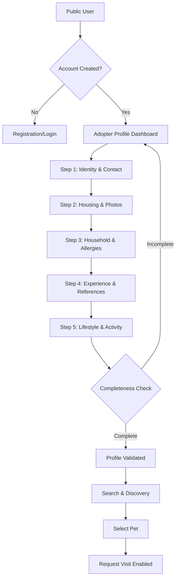

# Feature PRD Addendum: Adopter User Profiles

## Overview

| Metadata | Details |
| :--- | :--- |
| **Feature Name** | Adopter User Profiles |
| **Target Release** | Q4 2026 (Phase 1.1) |
| **Status** | In Progress |
| **Document Owner** | AI Assistant |

---

## Quick Links
- [Figma Design Template Placeholder](#)
- [Technical Specification Placeholder](#)
- [Project Management Ticket Placeholder](#)

---

## Background

### Context
In the Malik Shelter adoption process, staff need to verify that potential adopters have suitable living conditions, experience, and lifestyle to care for a specific animal. Currently, this data is collected manually or informally, leading to delays and potential mismatches.

### Problem Statement
The PRD (MVP) specifies that adopters must provide detailed identity, housing, household, experience, and lifestyle information. Without a structured profile creation process and completeness validation, staff cannot efficiently review applications, and visits might be scheduled for ill-equipped adopters.

---

## Objectives

### Business Objectives
- Ensure 100% data completeness for all adopter profiles before visit requests are allowed.
- Reduce visit cancellation rates by 15% through better preliminary matching.
- Accelerate staff review time for adoption applications by 25%.

### User Objectives
- **Adopters**: Provide a comprehensive "resumé" once, rather than repeating details for every pet.
- **Staff**: Quickly assess the eligibility and fit of an adopter based on objective criteria.

---

## Success Metrics

| Metric | Primary/Secondary | Baseline | Target | Measurement Method |
| :--- | :--- | :--- | :--- | :--- |
| **Profile Completion Rate** | Primary | N/A | 100% (of applicants) | DB count of 'Completed' vs 'Draft' profiles. |
| **Verification Lead Time** | Secondary | [48h] | [24h] | Timestamp difference (Submit -> Review). |
| **Visit Approval Rate** | Secondary | [60%] | [80%] | % of visit requests approved by staff. |

---

## Scope

### MVP ✅
- **Adopter Identity**: Name, Photo, Contact Information (Email, Phone), Physical Address, Occupation.
- **Housing Details**: Residence type (House/Apartment), Ownership permit (if renting), Outdoor area details (Fenced/Unfenced), Environment photos upload.
- **Household Info**: Resident count, Presence of children (and ages), Allergies (to pets), Existing pets (Species, Age, Temperament).
- **Pet Experience**: Ownership history (previous pets), Vet references (Name, Clinic, Contact).
- **Lifestyle Assessment**: Average time pets will spend alone per day, Activity level (Active/Sedentary), Future plans (Moving, Travel).
- **Validation Engine**: Hard check for completeness across all mandatory sections before "Request Visit" becomes active.

### Out-of-Scope ❌
- Third-party background checks or identity verification (e.g., ID scan/DocuSign).
- Social media integration for references.
- Private secure messaging for profile clarifications (handled via email).

---

## User Flow



---

## User Stories

| ID | User Story | Acceptance Criteria | Platform |
| :--- | :--- | :--- | :--- |
| **US-P1** | As an Adopter, I want to provide my identity and housing details | **Given** I am on the profile creation page<br>**When** I fill in my address and upload residence photos<br>**Then** the system saves these details as a draft | Web |
| **US-P2** | As an Adopter, I want to document my pet ownership history | **Given** I am in the "Experience" section<br>**When** I add previous pets and vet contact info<br>**Then** the system validates the email/phone format for references | Web |
| **US-P3** | As an Adopter, I want to know if my profile is complete enough to request a visit | **Given** I am viewing a pet's profile<br>**When** I attempt to click "Request Visit"<br>**Then** the button is only active if my profile status is 'Complete' | Web |
| **US-S5** | As Staff, I want to review an adopter's full profile | **Given** a pending visit request<br>**When** I view the request details<br>**Then** I see all Identity, Housing, Household, and Experience sections | Web (Admin) |

---

## Analytics & Tracking

| Event Name | Trigger | Parameters | Description |
| :--- | :--- | :--- | :--- |
| `profile_step_completed` | Clicking 'Next' in profile wizard | `step_name`, `is_first_time` | Tracks progress through the 5-step profile creation. |
| `profile_validation_failed` | Attempting to request visit with incomplete profile | `missing_fields_count`, `missing_sections` | Identifies where users drop off or fail completion. |

```json
{
  "Trigger": "Validation Check",
  "TriggerValue": "Profile Submission",
  "Page": "Profile Wizard",
  "Data": {
    "Status": "Failed",
    "MissingSections": ["Housing", "Experience"],
    "UserType": "New Adopter"
  },
  "Description": "User failed completeness check before visit request."
}
```

---

## Open Questions

| ID | Question | Status | Owner |
| :--- | :--- | :--- | :--- |
| OQ1 | Do we require a specific number of environment photos? | Open | Design |
| OQ2 | Should "Vet References" be mandatory for first-time owners? | Open | Product |

---

## Appendix
- **PII**: Personally Identifiable Information.
- **Completeness Check**: A logical check ensuring all mandatory DB fields for an Adopter are not null.
